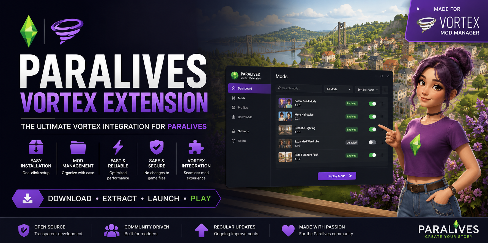

# Paralives-Vortex-Extension
Official Vortex Extension for Paralives. Easy mod installation, deployment, updates, and management

<div align="center">

# 🚀 Paralives Vortex Extension

### Simple. Fast. Reliable.

Manage your Paralives mods through Vortex with a streamlined installation experience.

[]()
[]()
[]()

---

### ⚡ Download • Extract • Launch • Play

</div>

---

## 📖 Overview

Paralives Vortex Extension adds support for Paralives within Vortex Mod Manager, allowing players to organize and manage their mods more efficiently.

The project is designed to provide a straightforward setup process and a clean modding workflow without requiring manual file management.

---

## ✨ Features

### 📦 Easy Installation

Download the release archive, extract it, and launch the installer.

### 🗂 Organized Mod Management

Keep your mod collection structured and easy to maintain.

### ⚡ Fast Setup

Get started in minutes without complex configuration.

### 🔄 Future Updates

Designed to support ongoing improvements and compatibility updates.

### 🔍 Transparent Development

Source code, releases, and documentation are available through this repository.

---

## 🚀 Quick Start

### Step 1 — Download

Download the latest release from the Releases section.

### Step 2 — Extract

Extract the ZIP archive to any folder.

### Step 3 — Launch

Run:

```text
Paralives-Vortex-Extension.exe
```

### Step 4 — Follow Setup

The installer will guide you through the remaining steps.

---

## 📸 Screenshots

### Main Interface


### Installation Process


### Extension Setup


---

## 📂 Project Structure

```text
Paralives-Vortex-Extension
│
├── Releases
├── Documentation
├── Source Code
├── Screenshots
└── Changelog
```

---

## 🔒 Security & Privacy

This project:

- Does not collect personal information
- Does not transmit user data
- Does not include advertisements
- Does not modify unrelated files
- Does not require online accounts

Users are encouraged to download releases only from official repository releases.

---

## 📋 Requirements

### Supported Software

- Vortex Mod Manager
- Paralives

### Supported Operating Systems

- Windows 10
- Windows 11

---

## ❓ FAQ

### Is this an official Paralives tool?

No. This is a community-developed project.

### Is the source code available?

Project information and development resources are available through this repository.

### Does it modify save files?

No save file modifications are performed by the extension.

### Can I uninstall it?

Yes. The extension can be removed through standard uninstall procedures.

---

## 🐞 Reporting Issues

If you encounter a problem:

1. Open the Issues tab.
2. Describe the issue.
3. Include screenshots if possible.
4. Include your Vortex version.

---

## 📈 Roadmap

- Improved installation workflow
- Enhanced compatibility detection
- Better diagnostics
- Additional quality-of-life features

---

## 📜 License

See the LICENSE file for details.

---

<div align="center">

### ⭐ Enjoying the project?

If this extension helps you, consider starring the repository.

Community feedback helps improve future releases.

</div>
